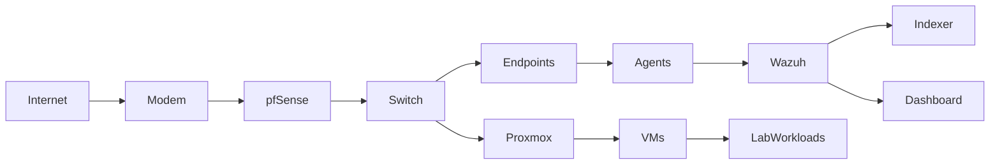

# SOC HomeLab

## Overview

This repository documents my SOC-focused homelab designed to develop practical skills in:

• Security Monitoring  
• Detection Engineering  
• Log Analysis  
• Incident Investigation  
• Infrastructure Troubleshooting  

This lab is not built for complexity for the sake of complexity.

It is built for **visibility, understanding, and failure analysis**.

The primary objective is to simulate realistic defensive security workflows while maintaining full control over the infrastructure stack.

---

## Architecture Diagram



---

## Lab Design Philosophy

This environment is structured around several core principles:

### Visibility First
Every component is selected to maximize telemetry and behavioral understanding rather than raw performance.

### Failure as a Learning Tool
Misconfigurations, outages, certificate issues, agent failures, and connectivity problems are treated as intentional learning opportunities.

### Detection-Oriented Thinking
The lab is designed to reinforce how attackers behave, how logs reflect activity, and how detections are formed.

---

## Core Technologies

### Firewall / Network Edge
**pfSense**

Used for:

• Network segmentation  
• DNS configuration  
• TLS / certificate experiments  
• Traffic inspection  
• Security control testing  

---

### Virtualization Platform
**Proxmox**

Used for:

• VM lifecycle management  
• Mixed workload simulation  
• Security tooling deployment  
• Snapshot / rollback testing  
• Failure scenario creation  

---

### Security Monitoring Platform
**Wazuh**

Used for:

• Agent-based telemetry collection  
• Log aggregation  
• Detection experimentation  
• Security event analysis  
• Dashboard visualization  

---

## Environment Components

### Endpoints
Mixed Windows and Linux systems used to generate realistic telemetry.

Examples:

• Workstation simulations  
• Test servers  
• Intentionally vulnerable systems  
• Logging experimentation targets  

---

### Agents
Wazuh agents deployed across lab systems to simulate enterprise telemetry pipelines.

Focus areas:

• Agent enrollment behavior  
• Version compatibility issues  
• Connectivity troubleshooting  
• Log source validation  

---

### Security Stack
Wazuh Manager  
Wazuh Indexer  
Wazuh Dashboard  

---

## Key Learning Areas

### Security Monitoring
Understanding:

• Event generation  
• Log pipelines  
• Agent telemetry behavior  
• Detection surfaces  

---

### Detection Engineering
Exploring:

• Behavioral patterns  
• Suspicious activity modeling  
• False positive analysis  
• Detection strategy design  

---

### Log Analysis
Practicing:

• Event correlation  
• Investigation workflows  
• Signal vs noise separation  
• Data interpretation  

---

### Infrastructure Troubleshooting
Real scenarios encountered:

• TLS / certificate trust failures  
• Agent version mismatches  
• Service connectivity issues  
• DNS resolution problems  
• Port binding conflicts  
• Firewall rule misconfigurations  

---

## Repository Structure

```
SOC-HomeLab/
│
├── docs/
│   ├── wazuh.md
│   ├── proxmox.md
│   ├── network.md
│   └── troubleshooting.md
│
├── diagrams/
│
└── README.md
```

---

## Documentation Scope

This repository captures:

• Build decisions  
• Configuration changes  
• Troubleshooting scenarios  
• Root cause analysis  
• Lessons learned  

The emphasis is on **thinking like a security practitioner**, not simply documenting successful setups.

---

## Why This Matters

Modern SOC / Detection roles require more than tool familiarity.

They require:

• Systems thinking  
• Troubleshooting discipline  
• Pattern recognition  
• Failure analysis  
• Clear technical communication  

This lab exists to build those skills deliberately.

---

## Disclaimer

This repository reflects a personal lab environment created for educational, research, and skills development purposes.

Configurations and architectural decisions may not represent production best practices.

All referenced systems are privately owned lab resources.
