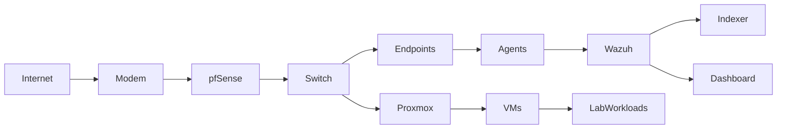

# SOC HomeLab

## Overview

This repository documents a SOC-focused homelab engineered to develop practical capabilities in:

• Security Monitoring  
• Detection Engineering  
• Log Pipeline Analysis  
• Incident Investigation  
• Infrastructure & Telemetry Troubleshooting  

This environment is not designed for complexity for its own sake.

It is intentionally built for **visibility, behavioral understanding, and failure analysis**.

The primary objective is to simulate realistic defensive security workflows while maintaining full control over the infrastructure, data sources, and telemetry flows.

---

## Architecture Diagram



---

## Lab Design Philosophy

This environment is structured around several guiding principles:

### Visibility Over Complexity

Technology choices prioritize telemetry depth, event clarity, and behavioral insight rather than raw performance metrics.

---

### Failure-Driven Learning

Misconfigurations, outages, certificate issues, agent failures, and ingestion problems are treated as deliberate learning surfaces.

Understanding **why systems break** is considered as valuable as understanding **how systems work**.

---

### Detection-Oriented Thinking

The lab reinforces how attacker behavior translates into logs, how signals emerge from noise, and how detections are formed from observable system activity.

---

## Core Technologies

### Firewall / Network Edge  
**pfSense**

Used for:

• Network segmentation and control testing  
• Traffic visibility and inspection  
• DNS and resolution experiments  
• TLS / certificate trust scenarios  
• Security control simulation  

---

### Virtualization Platform  
**Proxmox**

Used for:

• Workload simulation  
• Controlled failure scenarios  
• Security tooling deployment  
• Snapshot / rollback testing  
• Mixed OS telemetry generation  

---

### Security Monitoring Platform  
**Wazuh**

Used for:

• Agent based telemetry collection  
• Log aggregation and normalization  
• Detection experimentation  
• Security event analysis  
• Pipeline and ingestion validation  

---

## Environment Components

### Endpoints

Mixed Windows and Linux systems used to generate realistic operational telemetry.

Examples include:

• Workstation simulations  
• Test servers  
• Intentionally vulnerable workloads  
• Logging and detection experiments  

---

### Agents & Telemetry Sources

Wazuh agents deployed across lab systems to simulate enterprise-style telemetry pipelines.

Focus areas include:

• Enrollment and registration behavior  
• Connectivity and trust validation  
• Version compatibility analysis  
• Log source integrity verification  

---

### Security Stack

• Wazuh Manager  
• Wazuh Indexer  
• Wazuh Dashboard  

---

## Key Learning Domains

### Security Monitoring & Telemetry

Exploring:

• Event generation patterns  
• Log flow behavior  
• Telemetry visibility gaps  
• Signal reliability  

---

### Detection Engineering

Developing understanding of:

• Behavioral detection concepts  
• Suspicious activity modeling  
• False positive dynamics  
• Detection strategy design  

---

### Log & Event Analysis

Practicing:

• Event correlation workflows  
• Investigation techniques  
• Signal vs noise separation  
• Data interpretation and context building  

---

### Infrastructure & Pipeline Troubleshooting

Real-world scenarios encountered and analyzed:

• TLS / certificate trust failures  
• Agent version mismatches  
• Service connectivity issues  
• DNS resolution anomalies  
• Port binding conflicts  
• Firewall rule behavior  
• Log ingestion inconsistencies  
• Telemetry visibility gaps  

---

## Repository Structure

```bash
SOC-HomeLab/
│
├── docs/
│   ├── wazuh.md
│   ├── proxmox.md
│   ├── network.md
│   └── troubleshooting.md
│
├── diagrams/
│
└── README.md
```

---

## Documentation Scope

This repository captures:

• Architectural decisions  
• Configuration strategies  
• Troubleshooting investigations  
• Root cause analysis  
• Lessons learned  

The emphasis is on **operational security thinking and systems analysis**, rather than documenting only successful configurations.

---

## Why This Lab Exists

Modern SOC and Detection roles require more than tool familiarity.

They demand:

• Systems-level thinking  
• Telemetry interpretation skills  
• Troubleshooting discipline  
• Behavioral analysis mindset  
• Clear technical communication  

This lab is designed to deliberately develop those competencies.

---

## Disclaimer

This repository reflects a privately owned lab environment created for educational, research, and professional skills development purposes.

Configurations and architectural decisions are optimized for experimentation and learning, and may not represent production best practices.

All referenced systems are controlled lab resources.
