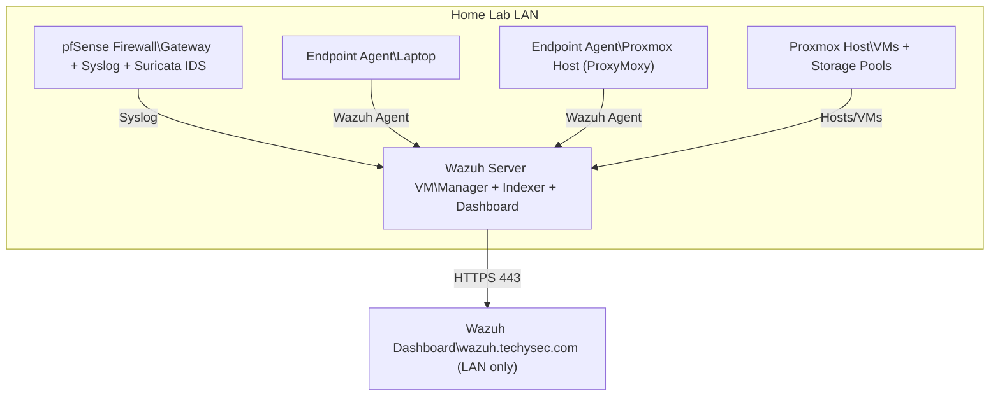
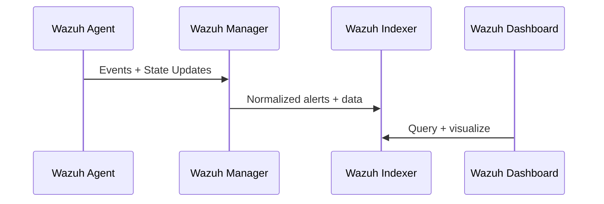
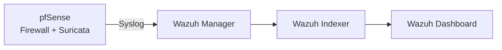

# Architecture & Data Flow

## Objective

Document the high level architecture of the homelab security monitoring stack and how telemetry flows into Wazuh for investigation and detection experimentation.

This lab is designed to simulate a realistic SOC style pipeline:

• Endpoint telemetry collection  
• Network security visibility  
• Centralized indexing  
• Analyst-facing dashboards  
• Troubleshooting and operational hardening  

---

## Environment Summary

Core infrastructure:

• Proxmox hypervisor hosting security and application VMs  
• pfSense firewall as the LAN gateway and perimeter control plane  
• Suricata IDS enabled on pfSense (initially WAN-IDS)  
• Wazuh all-in-one deployment (Manager + Indexer + Dashboard)  
• Internal DNS + split-horizon style testing using techysec.com subdomains  

---

## Logical Architecture (High Level)



---

## Wazuh Data Flow (Detail)

### 1) Endpoint Telemetry

Endpoints run Wazuh agents that collect:

• File integrity monitoring (FIM)  
• System inventory  
• Auth events  
• Local logs  
• Security-relevant signals (module-based)

Flow:



---

### 2) Network / Firewall Telemetry

pfSense forwards logs via syslog to the Wazuh server.

Log types typically include:

• Firewall events  
• System events  
• Suricata alerts (if configured to copy to system log or forwarded separately)  

Flow:



---

## Security Boundaries & Access Model

### LAN-only Access Goal

Wazuh Dashboard is intentionally kept LAN-only:

• No WAN port forwarding  
• No external exposure  
• Access through internal DNS (wazuh.techysec.com)  

This supports a safer lab posture while still enabling:

• TLS usage  
• DNS-based certificate issuance  
• Realistic access patterns  

---

## DNS & Certificates

### Why DNS-based validation matters

This environment includes:

• Dynamic WAN IP  
• Internal-only services  
• No desire to expose ports publicly  

Using DNS validation via Cloudflare API enables Let's Encrypt issuance without requiring inbound HTTP/HTTPS access from the internet.

---

## Storage & VM Placement Considerations

Wazuh is write-heavy.

Recommended storage placement:

• OS disk → NVMe (fast reads, stable performance)  
• Indexer data → NVMe (highest priority)  
• Backups → HDD  
• ISOs/templates → separate HDD storage  

Reasoning:

• Indexing and search performance benefit strongly from SSD/NVMe  
• HDD storage is better suited for backups and cold archives  

---

## Observability Notes

Common signals to validate during operations:

### Dashboard

```bash
sudo systemctl status wazuh-dashboard
sudo ss -lntp | grep 443
```

### Indexer

```bash
sudo systemctl status wazuh-indexer
sudo ss -lntp | egrep ':(9200|9300)\b'
```

### Manager

```bash
sudo systemctl status wazuh-manager
```

---

## Planned Next Architecture Improvements

Potential enhancements:

• Multi node deployment (separate indexer node)  
• Dedicated storage volumes for indexer data  
• Reverse proxy for cleaner certificate handling (optional)  
• Additional telemetry sources (Windows VM, DNS logs, proxy logs)  
• Suricata expansion to LAN interface (balanced with noise management)  

---

## Disclaimer

This architecture is a personal homelab project intended for:

• Learning  
• Portfolio development  
• Detection experimentation  

It is not production guidance and should be adapted to:

• Your risk model  
• Your network design  
• Your operational constraints  
